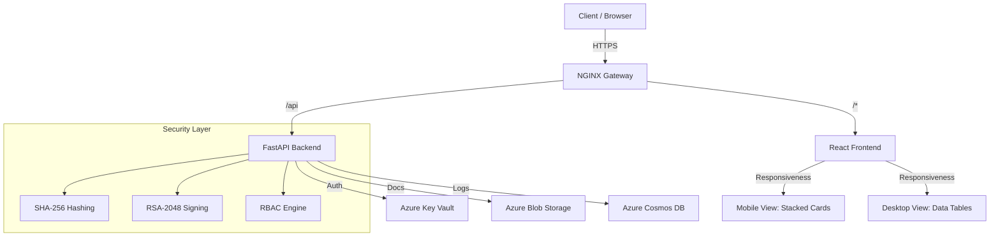
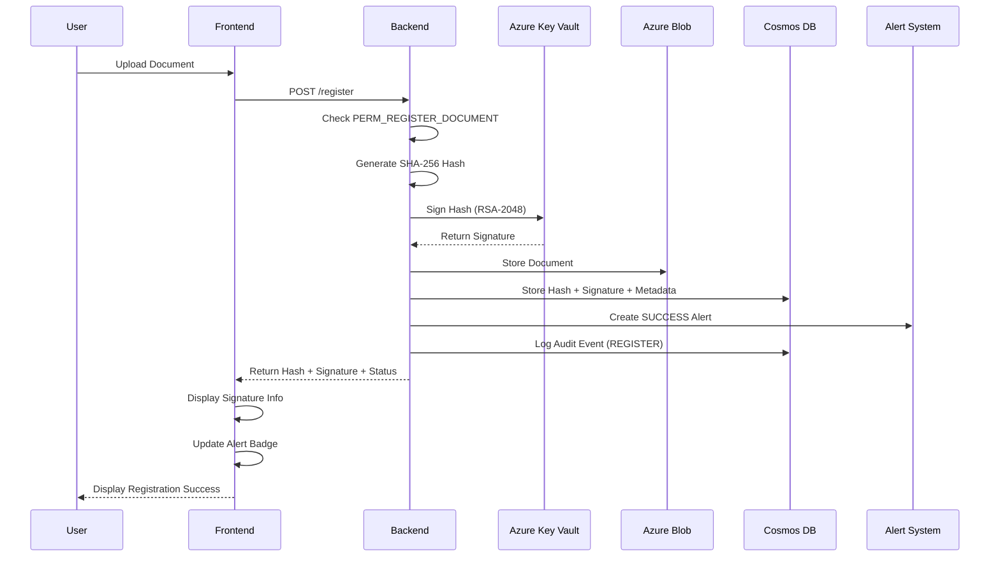
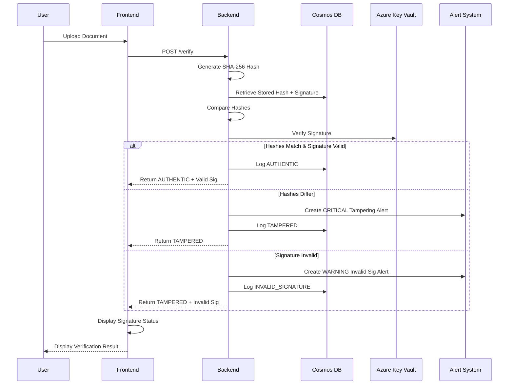

# 🛡️ DocVault - Enterprise Document Verification & Security System

<div align="center">

**A cloud-native document integrity verification system with cryptographic signatures, RBAC, and real-time security alerts**

[](https://react.dev)
[](https://tailwindcss.com)
[](https://fastapi.tiangolo.com)
[](https://azure.microsoft.com)
[](https://www.docker.com)
[](https://github.com)

### [🚀 Live Demo](http://51.120.24.245/) • [💻 Source Code](https://github.com/Jatin-code16/varitydoc.git)

[Features](#-features) • [Design System](#-neo-brutalist-design) • [Architecture](#%EF%B8%8F-architecture) • [Quick Start](#-quick-start) • [API Docs](#-api-documentation) • [Deployment](#-deployment)

</div>

---

## 📌 Overview

**DocVault** is an enterprise-grade document verification and security system that combines SHA-256 cryptographic hashing with **Azure Key Vault digital signatures**, **role-based access control (RBAC)**, and **real-time security alerts**. It provides a complete solution for registering documents with cryptographic proof, verifying their authenticity, maintaining comprehensive audit trails, and alerting on security events—all deployed on Azure with fully automated CI/CD pipelines.

### 🎯 Key Capabilities

- **🔐 Digital Signatures**: RSA-2048 cryptographic signing with Azure Key Vault for non-repudiation
- **👥 Role-Based Access Control**: 4-tier RBAC system (Admin, Document Owner, Auditor, Guest)
- **🚨 Real-Time Security Alerts**: Instant notifications for tampering, invalid signatures, and security events
- **🛡️ Tamper Detection**: SHA-256 hash-based verification combined with signature validation
- **☁️ Cloud Storage**: Azure Blob Storage integration for scalable document management
- **📊 Audit Trail**: Complete verification history with digital signature records in Azure Cosmos DB
- **🎨 Modern Frontend**: React SPA with Neo-Brutalist UI, real-time alerts, and role badges
- **⚡ Production Architecture**: NGINX reverse proxy with containerized microservices
- **🔄 Zero-Downtime Deployment**: Automated CI/CD with Docker Hub and Azure VM

---

## 🎨 Neo-Brutalist Design

Rebuilt with a **Neo-Brutalist** aesthetic, the current version emphasizes high contrast, bold typography, and a "function-over-form" philosophy—while remaining fully responsive across mobile and desktop devices.

- **🔳 High Contrast**: Thick, black borders (`border-4` on desktop, `border-2` on mobile) define every component.
- **📱 Mobile-First**: Tables transform into **"Stacked Cards"** on smaller screens to preserve data readability without horizontal scrolling.
- **⚡ Hard Shadows**: Distinctive `box-shadow` offsets (4px/8px) create a tactile, "pop-out" effect.
- **🔠 Typography**: Heavy use of bold, uppercase headers for clear hierarchy.

---

## 🚀 Features

### 🔒 Enterprise Security Features

#### Digital Signatures (Azure Key Vault)
- ✅ **RSA-2048 Cryptographic Signing**: Each document is digitally signed upon registration
- ✅ **Azure Key Vault Integration**: Secure key management with Hardware Security Module (HSM) backing
- ✅ **Signature Verification**: Automatic validation on document verification
- ✅ **Non-Repudiation**: Cryptographic proof of document origin and integrity
- ✅ **Fallback Mode**: Testing support without Key Vault for development

#### Role-Based Access Control (RBAC)
- 👑 **Admin Role**: Full system access, user management, role assignment, all audit logs
- 📄 **Document Owner**: Register and verify documents, view own alerts
- 🔍 **Auditor**: Read-only audit log access, verify documents, view all alerts
- 👤 **Guest**: Limited verification-only access
- ✅ **Permission Matrix**: 10+ granular permissions per role
- ✅ **API-Level Enforcement**: Every endpoint protected with permission checks

#### Real-Time Alert System
- 🚨 **Tampering Detection Alerts**: Critical alerts when hash mismatch detected
- ⚠️ **Signature Validation Alerts**: Warnings for invalid or missing signatures
- 📢 **Success Notifications**: Info alerts for successful registrations
- 🔔 **In-App Notifications**: Real-time alert panel with unread count badge
- 📧 **Email/SMS Ready**: Placeholders for Azure Communication Services integration
- 🎯 **Severity Levels**: INFO, WARNING, CRITICAL with color-coded UI

### Core Functionality
- ✅ **Document Registration**: Upload and hash documents with automatic cryptographic signing
- ✅ **Integrity Verification**: Compare uploaded documents against registered hashes + signatures
- ✅ **Audit Logging**: Track all verification attempts with timestamps, results, and signatures
- ✅ **User Management**: Admin endpoints for role assignment and user deactivation
- ✅ **RESTful API**: FastAPI backend with automatic OpenAPI documentation

### Technical Features
- 🔐 **Cryptographic Security**: SHA-256 hashing + RSA-2048 digital signatures
- 🔑 **Azure Key Vault**: Hardware-backed key management and signature operations
- 👥 **RBAC System**: 4 roles with granular permission checks on all endpoints
- 🚨 **Alert Engine**: Multi-severity notification system with in-memory storage
- ☁️ **Azure Integration**: Blob Storage + Cosmos DB + Key Vault
- 🐳 **Containerized**: Multi-stage Docker builds for optimized images
- 🔄 **CI/CD Pipeline**: GitHub Actions with automated testing and deployment
- 🌐 **Reverse Proxy**: NGINX configuration for `/api` routing
- 📱 **Responsive**: Mobile-optimized with adaptive layouts

---

## 🏗️ Architecture

### System Overview



### Technology Stack

#### Backend
| Component | Technology | Purpose |
|-----------|-----------|---------|
| API Framework | **FastAPI** | High-performance Python web framework |
| Document Storage | **Azure Blob Storage** | Cloud-native binary storage |
| Metadata Storage | **Azure Cosmos DB** | NoSQL database for hashes and logs |
| Hashing | **SHA-256** | Cryptographic integrity verification |
| Digital Signatures | **Azure Key Vault** | RSA-2048 signing with HSM backing |
| Authentication | **JWT Tokens** | Stateless user authentication |
| RBAC Engine | **Custom Python** | Role-based permission enforcement |
| Alert System | **In-Memory Store** | Real-time notification management |
| Server | **Uvicorn** | ASGI server for production |

#### Frontend
| Component | Technology | Purpose |
|-----------|-----------|---------|
| Framework | **React 19** | Modern UI library |
| Build Tool | **Vite** | Fast development and optimized builds |
| Styling | **Tailwind CSS** | Utility-first Neo-Brutalist design |
| HTTP Client | **Axios** | Promise-based API communication |
| State Management | **React Hooks** | Component state and effects |
| Components | **Lucide React** | Premium iconography |
| Web Server | **NGINX** | Static file serving + reverse proxy |

#### DevOps
| Component | Technology | Purpose |
|-----------|-----------|---------|
| Containerization | **Docker** | Consistent deployment environments |
| Orchestration | **Docker Compose** | Multi-container management |
| CI/CD | **GitHub Actions** | Automated build and deployment |
| Registry | **Docker Hub** | Container image repository |
| Cloud Platform | **Azure VM** | Production hosting environment |

---

## 📂 Project Structure

```
docvault/
├── .github/
│   └── workflows/
│       ├── docker-build.yml      # CI: Build & push Docker images
│       └── deploy.yml            # CD: Deploy to Azure VM
│
├── backend/
│   ├── main.py                   # FastAPI application + RBAC endpoints
│   ├── hash_service.py           # SHA-256 hashing implementation
│   ├── blob_service.py           # Azure Blob Storage operations
│   ├── cosmos_service.py         # Cosmos DB CRUD + signature metadata
│   ├── user_service.py           # User management + role assignment
│   ├── signature_service.py      # Azure Key Vault digital signatures
│   ├── rbac.py                   # Role-based access control system
│   ├── alert_service.py          # Real-time alert management
│   ├── auth.py                   # JWT authentication
│   ├── dependencies.py           # FastAPI dependencies
│   ├── requirements.txt          # Python dependencies
│   ├── Dockerfile                # Backend container definition
│   ├── ...                       # Setup guides (DIGITAL_SIGNATURES_SETUP.md, RBAC_SETUP.md)
│   └── uploads/                  # Temporary file storage
│
├── frontend/
│   ├── src/
│   │   ├── components/
│   │   │   ├── ui/               # Core UI Components (Card, Button, Badge)
│   │   │   ├── layout/           # AppShell, Navbar
│   │   │   └── ...               # Functional components
│   │   ├── pages/
│   │   │   ├── Dashboard.tsx     # Main dashboard
│   │   │   ├── AuditLogs.tsx     # Audit trail viewer
│   │   │   └── ...               # Other pages
│   │   ├── api/                  # Axios client
│   │   ├── lib/                  # Utils
│   │   └── ...
│   ├── public/                   # Static assets
│   ├── nginx.conf                # NGINX configuration
│   ├── Dockerfile                # Frontend container definition
│   ├── package.json              # Node.js dependencies
│   ├── vite.config.js            # Vite build configuration
│   └── tailwind.config.cjs       # Tailwind CSS configuration
│
├── nginx/
│   └── nginx.conf                # Production NGINX config
│
├── docker-compose.yml            # Multi-container orchestration
└── README.md                     # This file
```

---

## ⚙️ How It Works

### 1️⃣ Document Registration Flow (with Digital Signatures)



### 2️⃣ Document Verification Flow (with Signature Validation)



---

## 🚦 Quick Start

### Prerequisites

- **Docker** (v20.10+) and **Docker Compose** (v2.0+)
- **Node.js** (v18+) for local frontend development
- **Python** (v3.10+) for local backend development
- **Azure Account** with:
  - Storage Account (for Blob Storage)
  - Cosmos DB Account (for database)

### Environment Variables

Create `backend/.env`:

```env
# Azure Blob Storage
AZURE_STORAGE_CONNECTION_STRING=DefaultEndpointsProtocol=https;AccountName=...

# Azure Cosmos DB
COSMOS_ENDPOINT=https://your-cosmos-account.documents.azure.com:443/
COSMOS_KEY=your-cosmos-key-here
COSMOS_DATABASE=docvault
COSMOS_CONTAINER=documents

# Keys
AZURE_TENANT_ID=...
AZURE_CLIENT_ID=...
AZURE_CLIENT_SECRET=...
KEY_VAULT_URL=https://your-vault.vault.azure.net/
```

### 🐳 Running with Docker (Recommended)

```bash
# Clone repository
git clone https://github.com/yourusername/docvault.git
cd docvault

# Configure environment variables
cp backend/.env.example backend/.env
# Edit backend/.env with your Azure credentials

# Build and start all services
docker compose up --build

# Access the application
# Frontend: http://localhost
# Backend API: http://localhost/api/docs
```

### 💻 Local Development

#### Backend

```bash
cd backend
python -m venv venv
source venv/bin/activate  # On Windows: venv\Scripts\activate
pip install -r requirements.txt
uvicorn main:app --reload --port 8000
```

#### Frontend

```bash
cd frontend
npm install
npm run dev
```

---

## 📡 API Documentation

### Base URL
- **Development**: `http://localhost:8000`
- **Production**: `http://your-domain/api`

### Interactive API Docs

FastAPI provides automatic interactive documentation:
- **Swagger UI**: `http://localhost/api/docs`
- **ReDoc**: `http://localhost/api/redoc`

### Key Endpoints

#### 🔐 Authentication & User Management
- `POST /login`: Authenticate and receive JWT.
- `POST /register-user`: Create new user (Role Check).
- `GET /me`: Get current user info & unread alerts.

#### 📄 Document Operations
- `POST /register`: Registers document hash & signature (Requires Permission).
- `POST /verify`: Verifies document integrity & signature.

#### 📊 Audit & Alerts
- `GET /audit-logs`: List full system history (Admin/Auditor).
- `GET /alerts`: Get active security alerts.

---

## 🚀 Deployment

### Azure VM Setup

#### 1. Create Azure Resources
Create Resource Group, VM, Key Vault, Cosmos DB, and Storage Account via Azure Portal or CLI.

#### 2. Configure VM
SSH into your Azure VM, install Docker & Docker Compose.

```bash
# Configure environment
git clone https://github.com/yourusername/docvault.git
cd docvault
cp backend/.env.example backend/.env
# Add Azure credentials
```

#### 3. Initial Deployment

```bash
docker compose up -d
```

---

## 🔐 Security Considerations

### Implemented Security Measures

✅ **Digital Signatures**: RSA-2048 signatures with Azure Key Vault for non-repudiation  
✅ **Role-Based Access Control**: 4-tier permission system (admin/owner/auditor/guest)  
✅ **Real-Time Security Alerts**: Automated threat detection and notifications  
✅ **Cryptographic Hashing**: SHA-256 ensures document integrity  
✅ **JWT Authentication**: Stateless token-based auth with role/permission claims  
✅ **Environment Variables**: Sensitive credentials isolated from code  
✅ **Azure Managed Services**: Built-in encryption and security  
✅ **SSH Key Authentication**: Secure CI/CD deployment  
✅ **Audit Logging**: Comprehensive activity tracking for compliance

---

## 🧪 Testing

### Manual Testing

#### Register Document
```bash
curl -X POST "http://localhost/api/register" \
  -H "Authorization: Bearer <token>" \
  -F "file=@test.pdf" | jq
```

#### Verify Document
```bash
curl -X POST "http://localhost/api/verify" \
  -H "Authorization: Bearer <token>" \
  -F "file=@test.pdf" | jq
```

---

## 🔄 CI/CD Pipeline

The project uses GitHub Actions for automated build and deployment:

1.  **Build Workflow**: Checks out code, builds Frontend (Vite) & Backend (FastAPI) Docker images, and pushes to Docker Hub with Git SHA tags.
2.  **Deploy Workflow**: Connects to Azure VM via SSH, pulls new images, and updates containers with zero downtime.

---

## 📝 License

This project is licensed under the MIT License - see the [LICENSE](LICENSE) file for details.

---

## 👤 Author

**Jatin Naik**  
Azure Major Project - Cloud Computing & DevOps

**Project Focus Areas:**
- Cloud-native architecture (Azure)
- Containerization & orchestration (Docker/Compose)
- CI/CD automation (GitHub Actions)
- Microservices design patterns
- Document integrity & cryptography

---

## 🙏 Acknowledgments

- **FastAPI** for excellent API framework
- **React** ecosystem for modern frontend
- **Azure** for reliable cloud infrastructure
- **Docker** for containerization technology

---

<div align="center">

**⭐ If you find this project useful, please consider giving it a star!**

Built with ❤️ using Azure, Docker, React, and FastAPI

</div>
