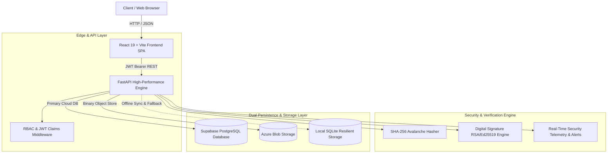
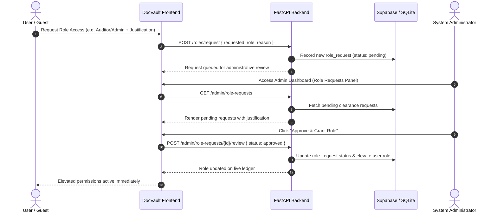

<div align="center">


<br /><br />

# DocVault
### Enterprise Document Integrity, Cryptographic Ledger & Security Ecosystem

**A cloud-native document verification and non-repudiation platform featuring SHA-256 integrity anchoring, RSA/Ed25519 digital signatures, multi-tier RBAC with role clearance delegation, and real-time security telemetry.**

<br />

[](https://react.dev)
[](https://vitejs.dev)
[](https://fastapi.tiangolo.com)
[](https://www.python.org/)
[](https://supabase.com)
[](https://azure.microsoft.com)
[](https://www.docker.com/)
[](https://github.com)

<br />

[Explore Features](#-key-capabilities) • [System Architecture](#%EF%B8%8F-system-architecture) • [RBAC & Clearance Matrix](#-role-based-access-control-rbac--clearance-delegation) • [Quick Start](#-quick-start) • [API Documentation](#-api-documentation) • [Production Deployment](#-production-deployment)

</div>

---

## 📌 Executive Overview

**DocVault** is an enterprise-grade document authenticity platform built for high-assurance workflows. It guarantees that any uploaded contract, certification, or data record is **tamper-evident, cryptographically authenticated, and verifiable anywhere in the world** without trusting third parties.

### Why DocVault?
In enterprise compliance, digital document forgery and unauthorized privilege escalation represent severe operational liabilities. DocVault resolves these challenges with:
- **Zero-Trust Integrity Verification**: Guarantees that single-bit modifications produce a totally different cryptographic digest (the Avalanche Effect).
- **Non-Repudiation**: Combines cryptographic SHA-256 digests with RSA/Ed25519 digital signatures signed with user identity keys.
- **Supabase-First with Offline Local Resilience**: Data is persisted to cloud PostgreSQL via Supabase while maintaining background cache synchronization with a local SQLite engine for zero-downtime offline functionality.
- **Role Elevation & Clearance Delegation**: Users can request elevated clearance tiers (`Document Owner`, `Security Auditor`, `Administrator`) with business justifications, reviewed by administrators via an executive dashboard.

---

## 🎯 Key Capabilities

| Capability | Technical Implementation | Value to Enterprise |
|---|---|---|
| **Deterministic Sealing** | SHA-256 cryptographic hashing | Instantaneous verification of file contents across any storage system. |
| **Identity Anchoring** | RSA-2048 / Ed25519 digital signatures | Unequivocally proves who authorized and registered the record. |
| **Multi-Tier RBAC** | 4-tier model (`Admin`, `Document Owner`, `Auditor`, `Guest`) | Enforces the Principle of Least Privilege across all endpoints. |
| **Role Clearance Workflow** | Interactive request & admin approval pipeline | Controlled privilege elevation with audit trail accountability. |
| **Hybrid Cloud Persistence** | Supabase (PostgreSQL) + Azure Blob Storage + SQLite fallback | High scalability in cloud environments with 100% offline uptime resilience. |
| **Forensic Audit Logging** | Immutable chronological event stream | Satisfies strict regulatory requirements (SOX, HIPAA, ISO 27001). |
| **Real-Time Security Alerts** | Automated polling & instant tampering notifications | Proactively flags tampering attempts and unauthorized API access. |
| **Neo-Brutalist Cyber UI** | High-contrast React 19 interface with theme switching | High data density, responsive sidebar navigation, and accessible UX. |

---

## 🏗️ System Architecture

### High-Level Topology


```mermaid
graph TD
    Client[Client / Web Browser] -->|HTTP / JSON| Frontend[React 19 + Vite Frontend SPA]
    
    subgraph Edge & API Layer
    Frontend -->|JWT Bearer REST| API[FastAPI High-Performance Engine]
    API --> Auth[RBAC & JWT Claims Middleware]
    end

    subgraph Security & Verification Engine
    API --> HashService[SHA-256 Avalanche Hasher]
    API --> SigService[Digital Signature RSA/Ed25519 Engine]
    API --> AlertEngine[Real-Time Security Telemetry & Alerts]
    end

    subgraph Dual Persistence & Storage Layer
    API -->|Primary Cloud DB| Supabase[(Supabase PostgreSQL Database)]
    API -->|Binary Object Store| AzureBlob[(Azure Blob Storage)]
    API -.->|Offline Sync & Fallback| SQLite[(Local SQLite Resilient Storage)]
    end
```

### Role Elevation & Clearance Workflow


```mermaid
sequenceDiagram
    autonumber
    actor User as User / Guest
    participant UI as DocVault Frontend
    participant API as FastAPI Backend
    participant DB as Supabase / SQLite
    actor Admin as System Administrator

    User->>UI: Request Role Access (e.g. Auditor/Admin + Justification)
    UI->>API: POST /roles/request { requested_role, reason }
    API->>DB: Record new role_request (status: pending)
    API-->>UI: Request queued for administrative review
    Admin->>UI: Access Admin Dashboard (Role Requests Panel)
    UI->>API: GET /admin/role-requests
    API->>DB: Fetch pending clearance requests
    API-->>UI: Render pending requests with justification
    Admin->>UI: Click "Approve & Grant Role"
    UI->>API: POST /admin/role-requests/{id}/review { status: approved }
    API->>DB: Update role_request status & elevate user role
    API-->>UI: Role updated on live ledger
    UI-->>User: Elevated permissions active immediately
```

---

## 👥 Role-Based Access Control (RBAC) & Clearance Delegation

DocVault enforces endpoint-level authorization using fine-grained permissions embedded inside signed JWT tokens:

| Permission | Administrator 👑 | Document Owner 📄 | Security Auditor 🔍 | Guest Sandbox 👤 |
|---|:---:|:---:|:---:|:---:|
| **Register & Seal Documents** | ✅ | ✅ | ❌ | ❌ |
| **Verify Document Integrity** | ✅ | ✅ | ✅ | ✅ |
| **Inspect System-Wide Documents** | ✅ | ❌ (Own only) | ✅ (All) | ❌ |
| **Examine Forensic Audit Logs** | ✅ | ❌ | ✅ | ❌ |
| **Export Audit Ledger (CSV/JSON)** | ✅ | ❌ | ✅ | ❌ |
| **Review & Approve Role Requests** | ✅ | ❌ | ❌ | ❌ |
| **Manage & Deactivate Users** | ✅ | ❌ | ❌ | ❌ |
| **View Executive Metrics & Health** | ✅ | ❌ | ❌ | ❌ |
| **Request Role Elevation** | ❌ (Root) | ✅ | ✅ | ✅ |

---

## 🔒 Security Principles & Interview Defense

| Concept | DocVault Implementation | Security Rationale |
|---|---|---|
| **Integrity vs. Authenticity** | SHA-256 generates a mathematical digest for **integrity**; RSA/Ed25519 digital signatures bind the digest to an identity for **authenticity & non-repudiation**. | A hash proves data wasn't modified in transit. A signature proves *who* legally registered and endorsed it. |
| **Avalanche Effect** | Cryptographic digest algorithms guarantee that even a 1-bit or 1-byte alteration drastically cascades across the output. | Guarantees tamper detection with zero tolerance for subtle document alterations. |
| **Fail-Safe Offline Resilience** | Supabase-first pattern with an automatic SQLite offline fallback and background synchronization. | Eliminates single-point-of-failure vulnerabilities; local development and degraded network scenarios never crash the app. |
| **Stateless Scalability** | Cryptographically signed JWT tokens with claims-based permissions and configurable expiration. | Enables horizontal scaling without session locking or server-side memory overhead. |
| **Audit Immutability** | Append-only audit trail logging timestamps, IP addresses, file digests, and authorization results. | Guarantees non-destructible event records suitable for legal and regulatory compliance. |

---

## 🚦 Quick Start

### Prerequisites
- **Python 3.10+**
- **Node.js 18+** & **npm**

---

### 1. Backend Setup

```bash
# Clone the repository
git clone https://github.com/Jatin-code16/varitydoc.git
cd varitydoc/backend

# Create and activate virtual environment
python -m venv venv

# Windows:
.\venv\Scripts\Activate.ps1
# macOS/Linux:
source venv/bin/activate

# Install required dependencies
pip install -r requirements.txt

# Launch FastAPI development server
uvicorn main:app --reload --port 8000
```

> **Backend API:** `http://localhost:8000`  
> **Interactive Swagger Documentation:** `http://localhost:8000/docs`  
> **ReDoc API Spec:** `http://localhost:8000/redoc`

---

### 2. Frontend Setup

In a separate terminal window:

```bash
cd varitydoc/frontend

# Install dependencies
npm install

# Start Vite development server
npm run dev
```

> **Frontend Application:** `http://localhost:5173`

---

## 🔑 Default Credentials & Evaluation

The system initializes with seeded accounts for evaluation:

| Username | Password | Default Role | Capabilities |
|---|---|---|---|
| `admin` | `adminpassword123` | **Administrator** | Root privileges: User administration, role request approvals, full audit logs |
| *(Guest Mode)* | *(No password)* | **Guest** | Instant sandbox access to test document verification and inspect ledger claims |

*(You can also use the **Sign Up** tab to create self-registered Document Owner accounts or submit role elevation requests).*

---

## ⚙️ Environment Configuration

Backend configuration is loaded via `backend/.env`:

```env
# Azure Blob Storage (Optional for local testing; defaults to local disk if omitted)
AZURE_STORAGE_CONNECTION_STRING="DefaultEndpointsProtocol=https;AccountName=...;AccountKey=...;EndpointSuffix=core.windows.net"

# Supabase PostgreSQL Configuration (Primary Cloud Storage)
SUPABASE_URL="https://your-project.supabase.co"
SUPABASE_KEY="your-supabase-service-role-key"

# CORS Configuration
ALLOWED_ORIGINS="http://localhost:5173,https://your-domain.vercel.app"
```

*(Note: If cloud credentials are not supplied, DocVault's offline engine automatically activates local SQLite storage, allowing full functionality out of the box).*

---

## 📡 API Documentation

### Authentication & Users
| Method | Endpoint | Description | Clearance |
|---|---|---|---|
| `POST` | `/login` | Authenticate credentials and receive Bearer JWT | Public |
| `POST` | `/signup` | Register a new Document Owner account | Public |
| `GET` | `/me` | Retrieve profile, active claims, and unread alert count | Authenticated |
| `POST` | `/users/change-password` | Rotate account password | Authenticated |

### Role Requests & Administration
| Method | Endpoint | Description | Clearance |
|---|---|---|---|
| `POST` | `/roles/request` | Submit a role elevation request with justification | Authenticated |
| `GET` | `/roles/requests/my` | View personal elevation request history and statuses | Authenticated |
| `GET` | `/admin/role-requests` | View all pending and reviewed clearance requests | `admin` |
| `POST` | `/admin/role-requests/{id}/review` | Approve or reject user clearance elevation | `admin` |
| `GET` | `/admin/users` | List registered user identities and account statuses | `admin` |
| `PUT` | `/admin/users/{user}/role` | Directly adjust user role | `admin` |
| `POST` | `/admin/users/{user}/deactivate` | Revoke user account access | `admin` |
| `GET` | `/admin/stats` | System telemetry, document counters, and health metrics | `admin` |

### Document Registry & Verification
| Method | Endpoint | Description | Clearance |
|---|---|---|---|
| `POST` | `/register` | Compute SHA-256, attach signature, seal document | `document_owner`, `admin` |
| `POST` | `/verify` | Inspect file digest against ledger to detect tampering | Public |
| `GET` | `/documents` | List registered documents (filtered by ownership) | Authenticated |
| `GET` | `/documents/search` | Search documents by filename | Authenticated |

### Auditing & Security Telemetry
| Method | Endpoint | Description | Clearance |
|---|---|---|---|
| `GET` | `/audit-logs` | Retrieve chronological audit history | `auditor`, `admin` |
| `GET` | `/alerts` | Query active security alerts and tampering notifications | Authenticated |
| `POST` | `/alerts/{id}/read` | Mark security alert as acknowledged | Authenticated |
| `DELETE` | `/alerts` | Clear notification history | Authenticated |

---

## 🐳 Production Deployment

### Docker Compose

Run the complete containerized stack in an isolated network:

```bash
docker compose up --build
```
- Frontend UI: `http://localhost`
- Backend API: `http://localhost/api`

### Cloud Hosting
- **Frontend (Vercel)**: Configured with `vercel.json` rewrite routing for single-page applications.
- **Backend (Render / Railway / Azure App Service)**: Deploy using `Dockerfile` or start command:
  ```bash
  uvicorn main:app --host 0.0.0.0 --port $PORT
  ```

---

## 👤 Author & Maintainer

**Jatin Naik**  
*Project Lead & Systems Architect*  
GitHub: [@Jatin-code16](https://github.com/Jatin-code16) • Repository: [DocVault](https://github.com/Jatin-code16/varitydoc)

---

<div align="center">

**DocVault** — Protecting digital document integrity with modern cryptographic engineering.

Built with React 19, FastAPI, Supabase, and Azure Cloud.

</div>
