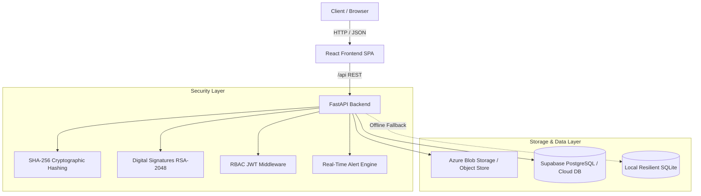
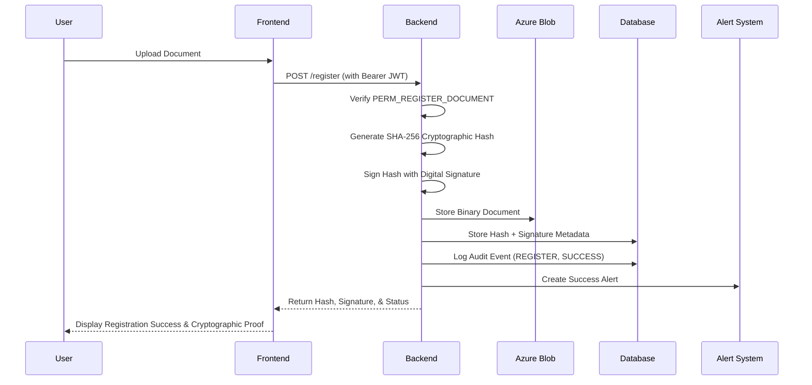
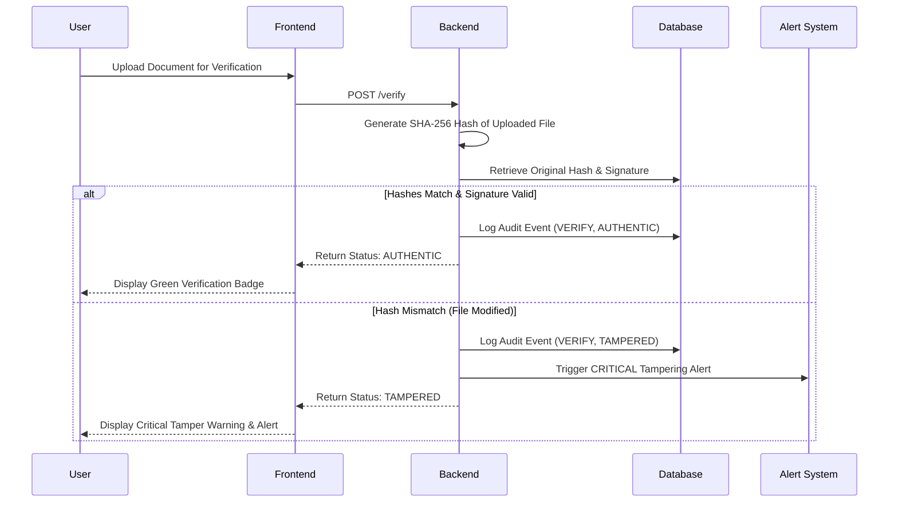

# 🛡️ DocVault - Enterprise Document Verification & Security System

<div align="center">

**A cloud-native document integrity verification system with cryptographic signatures, RBAC, and real-time security alerts**

[](https://react.dev)
[](https://fastapi.tiangolo.com)
[](https://www.python.org/)
[](https://supabase.com)
[](https://azure.microsoft.com)
[](https://github.com)

### [💻 Source Code](https://github.com/Jatin-code16/varitydoc.git) • [📡 API Documentation](#-api-documentation) • [🚦 Quick Start](#-quick-start)

[Overview](#-overview) • [Key Capabilities](#-key-capabilities) • [Architecture](#%EF%B8%8F-architecture) • [Security & Defense](#-security-principles--interview-defense) • [Quick Start](#-quick-start) • [API Docs](#-api-documentation)

</div>

---

## 📌 Overview

**DocVault** is an enterprise-grade document verification and security platform. It guarantees document authenticity and non-repudiation by combining **SHA-256 cryptographic hashing** with **digital signatures**, a **4-tier role-based access control (RBAC)** model, and **real-time security alerts**.

The platform is designed following enterprise software patterns: a high-contrast Neo-Brutalist frontend built with React, a high-performance FastAPI backend, specialized object storage for binaries, structured relational audit storage via Supabase PostgreSQL / Azure Cosmos DB, and an **offline-resilient adapter engine** ensuring high availability and zero downtime.

---

## 🎯 Key Capabilities

- **🔐 Cryptographic Signatures**: RSA-2048 signing backed by Azure Key Vault (with local cryptographic fallback for non-repudiation).
- **🛡️ Real-Time Tamper Detection**: Instant hash comparison detects single-bit file modifications and triggers security alerts.
- **👥 Role-Based Access Control (RBAC)**: 4-tier permission model (Admin, Document Owner, Auditor, Guest) enforced via JWT claims.
- **🚨 Security Alert System**: Real-time notifications for tampering, signature anomalies, and unauthorized access attempts.
- **☁️ Hybrid Cloud Storage**: Specialized binary storage via Azure Blob Storage paired with relational metadata in Supabase PostgreSQL / Azure Cosmos DB.
- **📊 Immutable Audit Trail**: Full historical logging of all document registrations, verification attempts, and security events.
- **🎨 Neo-Brutalist UI**: Modern high-contrast interface optimized for document auditing and data density across mobile and desktop.
- **⚡ Resilient Architecture**: Automatic local database fallback (SQLite) prevents crashes and enables zero-cost offline development.

---

## 🏗️ Architecture

### System Overview


```mermaid
graph TD
    User[Client / Browser] -->|HTTP / JSON| UI[React Frontend SPA]
    UI -->|/api REST| API[FastAPI Backend]
    
    subgraph Security Layer
    API --> HMAC[SHA-256 Cryptographic Hashing]
    API --> Sign[Digital Signatures RSA-2048]
    API --> RBAC[RBAC JWT Middleware]
    API --> Alerts[Real-Time Alert Engine]
    end
    
    subgraph Storage & Data Layer
    API --> Blob[Azure Blob Storage / Object Store]
    API --> DB[(Supabase PostgreSQL / Cloud DB)]
    API -.->|Offline Fallback| LocalDB[(Local Resilient SQLite)]
    end
```

### Technology Stack

| Layer | Component | Technology | Purpose |
|---|---|---|---|
| **Frontend** | Framework | **React 19** + **Vite** | Single Page Application with dynamic state |
| | Styling | **Vanilla CSS + Tailwind** | Responsive Neo-Brutalist design |
| | Icons | **Lucide React** | Enterprise visual hierarchy |
| | HTTP Client | **Axios** | Token-authenticated REST communication |
| **Backend** | Framework | **FastAPI** | High-performance ASGI Python framework |
| | Server | **Uvicorn** | Asynchronous production server |
| | Auth & RBAC | **JWT (python-jose) + passlib** | Stateless token authentication & permission claims |
| | Cryptography | **SHA-256 + RSA-2048** | Document integrity and digital signatures |
| **Data & Cloud** | Database | **Supabase (PostgreSQL)** / **Cosmos DB** | Structured documents, audit logs, and user profiles |
| | Storage | **Azure Blob Storage** | Unstructured binary file storage |
| | Resilience | **SQLite Engine** | Zero-setup local fallback for offline/testing |

---

## ⚙️ How It Works

### 1️⃣ Document Registration Flow


```mermaid
sequenceDiagram
    User->>Frontend: Upload Document
    Frontend->>Backend: POST /register (with Bearer JWT)
    Backend->>Backend: Verify PERM_REGISTER_DOCUMENT
    Backend->>Backend: Generate SHA-256 Cryptographic Hash
    Backend->>Backend: Sign Hash with Digital Signature
    Backend->>Azure Blob: Store Binary Document
    Backend->>Database: Store Hash + Signature Metadata
    Backend->>Database: Log Audit Event (REGISTER, SUCCESS)
    Backend->>Alert System: Create Success Alert
    Backend-->>Frontend: Return Hash, Signature, & Status
    Frontend-->>User: Display Registration Success & Cryptographic Proof
```

### 2️⃣ Document Verification Flow (Tamper Detection)


```mermaid
sequenceDiagram
    User->>Frontend: Upload Document for Verification
    Frontend->>Backend: POST /verify
    Backend->>Backend: Generate SHA-256 Hash of Uploaded File
    Backend->>Database: Retrieve Original Hash & Signature
    alt Hashes Match & Signature Valid
        Backend->>Database: Log Audit Event (VERIFY, AUTHENTIC)
        Backend-->>Frontend: Return Status: AUTHENTIC
        Frontend-->>User: Display Green Verification Badge
    else Hash Mismatch (File Modified)
        Backend->>Database: Log Audit Event (VERIFY, TAMPERED)
        Backend->>Alert System: Trigger CRITICAL Tampering Alert
        Backend-->>Frontend: Return Status: TAMPERED
        Frontend-->>User: Display Critical Tamper Warning & Alert
    end
```

---

## 🔒 Security Principles & Interview Defense

| Concept | Implementation in DocVault | Why it Matters |
|---|---|---|
| **Integrity vs Authenticity** | SHA-256 provides **integrity**; RSA-2048 signatures provide **authenticity & non-repudiation**. | A hash proves a file has not changed. A signature proves *who* registered and authorized it. |
| **Avalanche Effect** | Cryptographic hashing guarantees that altering even a single whitespace or bit modifies ~50% of the hash output. | Guarantees deterministic, foolproof detection of unauthorized document tampering. |
| **Granular RBAC** | 4 roles (`admin`, `document_owner`, `auditor`, `guest`) enforced at the endpoint level via FastAPI dependencies. | Prevents privilege escalation and enforces the Principle of Least Privilege. |
| **Immutable Audit Logging** | Append-only event stream tracking every verification, registration, and tampering incident. | Fulfills regulatory compliance requirements (SOX, HIPAA, ISO 27001). |
| **Decoupled Architecture** | Adapter pattern with cloud database (Supabase) and local engine fallback (SQLite). | Enterprise resilience: prevents single-point-of-failure cloud dependency during testing or outages. |

---

## 👥 Role-Based Access Control (RBAC) Matrix

| Permission | Admin 👑 | Document Owner 📄 | Auditor 🔍 | Guest 👤 |
|---|:---:|:---:|:---:|:---:|
| **Register Documents** | ✅ | ✅ | ❌ | ❌ |
| **Verify Documents** | ✅ | ✅ | ✅ | ✅ |
| **View Full Audit Logs** | ✅ | ❌ | ✅ | ❌ |
| **Export Audit Logs** | ✅ | ❌ | ✅ | ❌ |
| **Manage Users & Roles** | ✅ | ❌ | ❌ | ❌ |
| **View System Stats** | ✅ | ❌ | ❌ | ❌ |
| **View Own Documents** | ✅ | ✅ | ✅ (All) | ❌ |

---

## 🚦 Quick Start

### Prerequisites
- **Python 3.10+**
- **Node.js 18+**

### 1. Backend Setup

```bash
# Navigate to backend directory
cd backend

# Create and activate virtual environment
python -m venv venv

# Windows:
.\venv\Scripts\Activate.ps1
# macOS/Linux:
source venv/bin/activate

# Install dependencies
pip install -r requirements.txt

# Start backend server
uvicorn main:app --reload --port 8000
```

> **Backend is live at:** `http://localhost:8000`  
> **Interactive Swagger Docs:** `http://localhost:8000/docs`

### 2. Frontend Setup

In a new terminal window:

```bash
# Navigate to frontend directory
cd frontend

# Install dependencies
npm install

# Start Vite development server
npm run dev
```

> **Frontend is live at:** `http://localhost:5173`

---

## 🔑 Default Accounts

The system automatically initializes a pre-seeded Admin user for evaluation:

| Username | Password | Role | Access Level |
|---|---|---|---|
| `admin` | `adminpassword123` | **Admin** | Full system administration, audit logs, and user management |

*(You can also use the **Sign Up** tab to create self-registered Document Owner accounts).*

---

## ⚙️ Environment Configuration

Configuration is managed via `backend/.env`:

```env
# Azure Blob Storage (Optional for local testing; uses local disk fallback if omitted)
AZURE_STORAGE_CONNECTION_STRING="your_azure_storage_connection_string_here"

# Supabase Database Configuration
SUPABASE_URL="https://your-project.supabase.co"
SUPABASE_KEY="your-supabase-service-role-or-anon-key"
```

*(Note: If cloud variables are not provided, DocVault transparently activates its local SQLite fallback engine, allowing full functionality out of the box).*

---

## 📡 API Documentation

FastAPI generates automatic OpenAPI documentation:
- **Swagger UI**: `http://localhost:8000/docs`
- **ReDoc**: `http://localhost:8000/redoc`

### Key Endpoints

| Method | Endpoint | Description | Auth Required |
|---|---|---|---|
| `POST` | `/login` | Authenticate and obtain JWT access token | No |
| `POST` | `/signup` | Self-register a new Document Owner account | No |
| `GET` | `/me` | Get current user profile and permissions | Yes |
| `POST` | `/register` | Hash, sign, and store document | Yes (`document_owner`, `admin`) |
| `POST` | `/verify` | Check document integrity & signature validity | No |
| `GET` | `/audit-logs` | Retrieve chronological audit history | Yes (`auditor`, `admin`) |
| `GET` | `/alerts` | Get user/system security notifications | Yes |
| `GET` | `/admin/stats` | System metrics & recent activity | Yes (`admin`) |
| `GET` | `/admin/users` | List all registered system users | Yes (`admin`) |

---

## 🐳 Docker Deployment (Optional)

To run the entire system in isolated containers:

```bash
docker compose up --build
```
- Frontend: `http://localhost`
- Backend API: `http://localhost/api/docs`

---

## 👤 Author

**Jatin Naik**  
*DocVault - Enterprise Document Verification & Security System*

---

<div align="center">

Built with ❤️ using React, FastAPI, Python, and Modern Cloud Architecture

</div>
