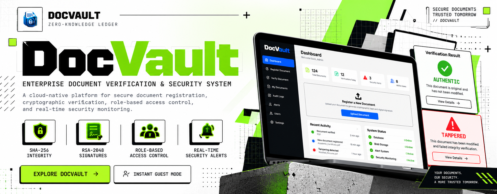
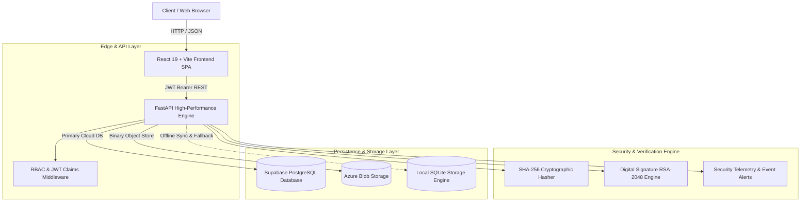
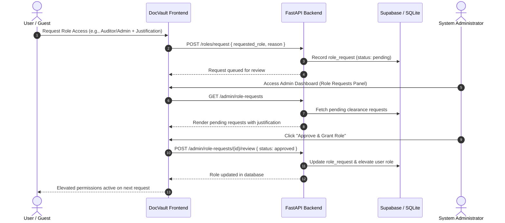

<div align="center">



<br /><br />

# DocVault
### Secure Document Verification & Cryptographic Integrity Platform

**A cloud-native platform featuring SHA-256 content integrity checks, digital-signature-based authenticity verification, role-based access control (RBAC), and security event logging.**

<br />

[](https://react.dev)
[](https://vitejs.dev)
[](https://fastapi.tiangolo.com)
[](https://www.python.org/)
[](https://supabase.com)
[](https://azure.microsoft.com)
[](https://www.docker.com/)
[](https://github.com)

<br />

[Technical Pillars](#-core-security-architecture--responsibilities) • [Capabilities](#-key-capabilities) • [System Topology](#%EF%B8%8F-system-architecture) • [RBAC Model](#-role-based-access-control-rbac--clearance-delegation) • [Quick Start](#-quick-start) • [API Documentation](#-api-documentation) • [Deployment](#-deployment-ready-architecture)

</div>

---

## 📌 Project Overview

**DocVault** is a secure document verification platform built to detect unauthorized modifications and verify signing identities. Rather than relying on third-party trust or opaque assertions, DocVault provides demonstrable integrity verification by combining **SHA-256 cryptographic hashing**, **asymmetric digital signatures**, **role-based access control (RBAC)**, and **append-oriented event logging**.

The system is organized around a high-performance FastAPI backend, a high-contrast React 19 single-page interface, cloud storage (Supabase PostgreSQL / Azure Blob Storage), and a local SQLite fallback engine for development and offline continuity.

---

## 🔍 Core Security Architecture & Responsibilities

DocVault strictly separates distinct security concerns across four modular technical controls:

```
  SHA-256 Hashing
        ↓
  Detects whether document content changed (Content Integrity)

  Digital Signatures (RSA-2048 / RS256)
        ↓
  Verifies digest against configured RSA signing key (Signing Authenticity)

  Role-Based Access Control (RBAC)
        ↓
  Controls what authenticated users are authorized to do (Authorization)

  Append-Oriented Audit Logging
        ↓
  Records security-relevant events and actions (Traceability)
```

> **Technical Distinction:**
> - **SHA-256 hashing** detects whether document bits have changed since registration.
> - **Digital signatures** verify that the document digest was signed by the configured RSA signing key; the application records the associated user account for traceability.
> - **RBAC** restricts API operations to authorized identities.
> - **Audit logging** maintains a chronological record of registration, verification, and tamper events.
>
> Each control addresses a distinct security requirement without conflating cryptographic verification with legal compliance guarantees.

---

## 🎯 Key Capabilities

| Capability | Technical Mechanism | Technical Function |
|---|---|---|
| **Content Integrity Checks** | SHA-256 cryptographic hashing | Computes a deterministic digest to detect single-bit modifications in document files. |
| **Identity Verification** | RSA-2048 digital signatures | Signs the document digest using a configured RSA signing key and records the associated application user. |
| **Role-Based Access Control** | 4-tier model (`Admin`, `Document Owner`, `Auditor`, `Guest`) | Enforces the Principle of Least Privilege across all API endpoints. |
| **Role Clearance Pipeline** | Justification-based request & review workflow | Provides structured privilege elevation reviewed and authorized by administrators. |
| **Dual Persistence Engine** | Supabase (PostgreSQL) + Azure Blob Storage + SQLite fallback | Primary cloud persistence with local SQLite fallback for development and offline operation. |
| **Append-Oriented Event Logging** | Event stream logging (action, result, timestamp, actor) | Maintains traceable audit records designed with security and auditability considerations. |
| **Security Alerts** | Automated polling & hash mismatch notification | Flags document modification events and unauthorized access attempts in real time. |
| **High-Density Web UI** | Modern React 19 interface with theme switching | Responsive workspace with sidebar navigation, search filtering, and inspection views. |

---

## 🏗️ System Architecture

### High-Level Topology


```mermaid
graph TD
    Client[Client / Web Browser] -->|HTTP / JSON| Frontend[React 19 + Vite Frontend SPA]
    
    subgraph Edge & API Layer
    Frontend -->|JWT Bearer REST| API[FastAPI High-Performance Engine]
    API --> Auth[RBAC & JWT Claims Middleware]
    end

    subgraph Security & Verification Engine
    API --> HashService[SHA-256 Cryptographic Hasher]
    API --> SigService[Digital Signature RSA-2048 Engine]
    API --> AlertEngine[Security Telemetry & Event Alerts]
    end

    subgraph Persistence & Storage Layer
    API -->|Primary Cloud DB| Supabase[(Supabase PostgreSQL Database)]
    API -->|Binary Object Store| AzureBlob[(Azure Blob Storage)]
    API -.->|Offline Sync & Fallback| SQLite[(Local SQLite Storage Engine)]
    end
```

### Role Elevation & Clearance Workflow


```mermaid
sequenceDiagram
    autonumber
    actor User as User / Guest
    participant UI as DocVault Frontend
    participant API as FastAPI Backend
    participant DB as Supabase / SQLite
    actor Admin as System Administrator

    User->>UI: Request Role Access (e.g., Auditor/Admin + Justification)
    UI->>API: POST /roles/request { requested_role, reason }
    API->>DB: Record role_request (status: pending)
    API-->>UI: Request queued for review
    Admin->>UI: Access Admin Dashboard (Role Requests Panel)
    UI->>API: GET /admin/role-requests
    API->>DB: Fetch pending clearance requests
    API-->>UI: Render pending requests with justification
    Admin->>UI: Click "Approve & Grant Role"
    UI->>API: POST /admin/role-requests/{id}/review { status: approved }
    API->>DB: Update role_request & elevate user role
    API-->>UI: Role updated in database
    UI-->>User: Elevated permissions active on next request
```

---

## 👥 Role-Based Access Control (RBAC) & Clearance Delegation

DocVault enforces endpoint-level authorization using fine-grained permissions embedded inside signed JWT tokens:

| Permission | Administrator 👑 | Document Owner 📄 | Security Auditor 🔍 | Guest Sandbox 👤 |
|---|:---:|:---:|:---:|:---:|
| **Register & Seal Documents** | ✅ | ✅ | ❌ | ❌ |
| **Verify Document Integrity** | ✅ | ✅ | ✅ | ✅ |
| **Inspect System-Wide Documents** | ✅ | ❌ (Own only) | ✅ (All) | ❌ |
| **Examine Audit Logs** | ✅ | ❌ | ✅ | ❌ |
| **Export Audit Ledger (CSV/JSON)** | ✅ | ❌ | ✅ | ❌ |
| **Review & Approve Role Requests** | ✅ | ❌ | ❌ | ❌ |
| **Manage & Deactivate Users** | ✅ | ❌ | ❌ | ❌ |
| **View System Telemetry & Health** | ✅ | ❌ | ❌ | ❌ |
| **Request Role Elevation** | ❌ (Root) | ✅ | ✅ | ✅ |

---

## 🔒 Security Principles & Technical Rationale

| Principle | DocVault Implementation | Technical Rationale |
|---|---|---|
| **Integrity vs. Authenticity** | SHA-256 generates a digest for **content integrity**; digital signatures verify **signing authenticity** via the configured RSA key. | A hash verifies that file content matches its recorded digest. A signature proves the digest was signed by the configured key, while the application logs the associated user account. |
| **Avalanche Effect** | Cryptographic hashing guarantees that modifying even a single whitespace or bit drastically alters the digest output. | Enables reliable tamper detection through straightforward string comparison of hash digests. |
| **Local Fallback Engine** | Cloud database (Supabase) queried first, with automatic local SQLite fallback and cache synchronization. | Avoids single-point-of-failure cloud dependence; enables full functional testing and development offline. |
| **Stateless Authorization** | Cryptographically signed JWT tokens carrying claims-based roles and expiration timestamps. | Enables horizontal scaling without session store bottlenecks or server-side memory locks. |
| **Append-Oriented Audit Records** | Sequential logging of timestamps, event types, file hashes, and authorization results. | Designed with security and auditability considerations relevant to regulated environments. |

---

## 🔐 System Access & Security Configuration

Administrator credentials and security secrets are configured securely via environment variables:

```env
# Required Authentication & Security Variables
JWT_SECRET_KEY=<long-random-cryptographic-secret>
ADMIN_USERNAME=admin
ADMIN_PASSWORD=<strong-random-password>
ADMIN_EMAIL=admin@docvault.local
```

| Access Mode | Entry Point | Credentials | Permissions / Clearance |
|---|---|---|---|
| **System Administrator** | `/login` | Set via `ADMIN_USERNAME` / `ADMIN_PASSWORD` in `.env` | Full user administration, role requests review, system audit log inspection |
| **Document Owner** | `/signup` / `/login` | User-registered (minimum 8-character password) | Document registration, verification, personal document management |
| **Guest Sandbox** | `Instant Guest Mode` | None (Session initiated via `/login/guest`) | Document verification and public tamper inspection |

---

## 🚦 Quick Start

### Prerequisites
- **Python 3.10+**
- **Node.js 18+** & **npm**

---

### 1. Backend Setup

```bash
# Clone the repository
git clone https://github.com/Jatin-code16/varitydoc.git
cd varitydoc/backend

# Create and activate virtual environment
python -m venv venv

# Windows:
.\venv\Scripts\Activate.ps1
# macOS/Linux:
source venv/bin/activate

# Install required dependencies
pip install -r requirements.txt

# Launch FastAPI development server
uvicorn main:app --reload --port 8000
```

> **Backend API:** `http://localhost:8000`  
> **Interactive Swagger Documentation:** `http://localhost:8000/docs`  
> **ReDoc API Spec:** `http://localhost:8000/redoc`

---

### 2. Frontend Setup

In a separate terminal window:

```bash
cd varitydoc/frontend

# Install dependencies
npm install

# Start Vite development server
npm run dev
```

> **Frontend Application:** `http://localhost:5173`

---

## ⚙️ Environment Configuration

Backend configuration is loaded via `backend/.env`:

```env
# JWT & Administrator Security Configuration
JWT_SECRET_KEY="your-random-32-byte-hex-or-base64-secret"
ADMIN_USERNAME="admin"
ADMIN_PASSWORD="YourStrongPasswordHere"
ADMIN_EMAIL="admin@docvault.local"

# Azure Blob Storage (Optional for local testing; defaults to local disk if omitted)
AZURE_STORAGE_CONNECTION_STRING="DefaultEndpointsProtocol=https;AccountName=...;AccountKey=...;EndpointSuffix=core.windows.net"

# Supabase PostgreSQL Configuration (Primary Cloud Storage)
SUPABASE_URL="https://your-project.supabase.co"
SUPABASE_KEY="your-supabase-service-role-key"

# CORS Configuration
ALLOWED_ORIGINS="http://localhost:5173,https://your-domain.vercel.app"
```

*(Note: If cloud credentials are not supplied, DocVault's local engine automatically activates SQLite storage, allowing full offline functionality for local development).*

---

## 📡 API Documentation

### Authentication & Users
| Method | Endpoint | Description | Clearance |
|---|---|---|---|
| `POST` | `/login` | Authenticate credentials and receive Bearer JWT | Public |
| `POST` | `/signup` | Register a new Document Owner account | Public |
| `GET` | `/me` | Retrieve profile, active claims, and unread alert count | Authenticated |
| `POST` | `/users/change-password` | Update account password | Authenticated |

### Role Requests & Administration
| Method | Endpoint | Description | Clearance |
|---|---|---|---|
| `POST` | `/roles/request` | Submit a role elevation request with justification | Authenticated |
| `GET` | `/roles/requests/my` | View personal elevation request history and statuses | Authenticated |
| `GET` | `/admin/role-requests` | View pending and reviewed clearance requests | `admin` |
| `POST` | `/admin/role-requests/{id}/review` | Approve or reject user clearance elevation | `admin` |
| `GET` | `/admin/users` | List registered user identities and account statuses | `admin` |
| `PUT` | `/admin/users/{user}/role` | Adjust user role | `admin` |
| `POST` | `/admin/users/{user}/deactivate` | Revoke user account access | `admin` |
| `GET` | `/admin/stats` | System telemetry, document counters, and health metrics | `admin` |

### Document Registry & Verification
| Method | Endpoint | Description | Clearance |
|---|---|---|---|
| `POST` | `/register` | Compute SHA-256, attach signature, register document | `document_owner`, `admin` |
| `POST` | `/verify` | Inspect file digest against registered record to detect tampering | Public |
| `GET` | `/documents` | List registered documents (filtered by ownership) | Authenticated |
| `GET` | `/documents/search` | Search documents by filename | Authenticated |

### Auditing & Security Telemetry
| Method | Endpoint | Description | Clearance |
|---|---|---|---|
| `GET` | `/audit-logs` | Retrieve chronological audit history | `auditor`, `admin` |
| `GET` | `/alerts` | Query active security alerts and tampering notifications | Authenticated |
| `POST` | `/alerts/{id}/read` | Mark security alert as acknowledged | Authenticated |
| `DELETE` | `/alerts` | Clear notification history | Authenticated |

---

## 🐳 Deployment-Ready Architecture

### Docker Compose

Run the complete containerized stack in an isolated network:

```bash
docker compose up --build
```
- Frontend UI: `http://localhost`
- Backend API: `http://localhost/api`

### Cloud Hosting
- **Frontend (Vercel)**: Configured with `vercel.json` rewrite routing for single-page applications.
- **Backend (Render / Railway / Azure App Service)**: Deploy using `Dockerfile` or start command:
  ```bash
  uvicorn main:app --host 0.0.0.0 --port $PORT
  ```

---

## 👤 Author & Maintainer

**Jatin Naik**  
GitHub: [@Jatin-code16](https://github.com/Jatin-code16) • Repository: [DocVault](https://github.com/Jatin-code16/varitydoc)

---

<div align="center">

**DocVault** — Secure document verification and cryptographic integrity platform.

Built with React 19, FastAPI, Supabase, and Azure Cloud.

</div>
